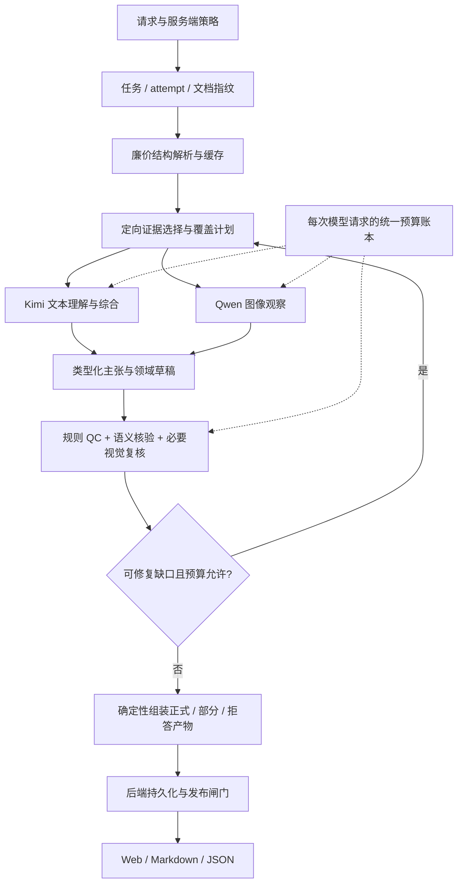

# 文献分析平台改进计划与 agent 实施交接

版本：1.0 · 日期：2026-10-04 · 状态：规划完成，实施待启动。

本文面向后续承担代码修改、测试及集成的 agent。当前 chat 的角色为规划者：审计现状、冻结目标、定义依赖与验收，不继续实现业务代码。本计划不把设计方案写成已完成功能。

## 1. 项目目标与本轮边界

构建面向**分子生物学、生物信息学、表观遗传学**的文献分析平台。沿用 CrewAI、Python 后端、parser / LLM / storage 适配层及轻量 Web 前端。

- **Kimi 文本链路**：理解重点章节、建立主张、综合故事架构、识别证据缺口、回答问题、组织 benchmark 和核验意见。
- **Qwen 图像链路**：使用用户指定的 `qwen3.8-flash` 接收实际图像，提取目标图/子图的观察，并进行必要的独立视觉复核。
- **后端负责**：文档、任务、分析轮次、证据、预算、模型路由、缓存、正式产物和审计。前端只保存当前交互状态。
- **本轮完成目标**：不依赖人工标注即可打通的分析/问答 agent loop、调用治理、token 预算、分析强度、结构化产物、失败恢复和工程验收。

模型名称与端点应独立配置。`qwen3.8-flash` 的当前项目可用性依据 [2026-10-03 冒烟记录](QWEN_SMOKE_2026-10-03.md)，不能推定其他 Qwen 接口支持该别名。Kimi 的具体 model ID 沿用用户配置，不擅自换成另一个型号。切换目的地不能复用另一供应商密钥。

本轮不引入：模型训练、外部论文检索、跨论文知识库、分布式队列、自动代理执行任意代码、临床决策功能。保留多论文扩展接口，但不能为此重写单篇链路。

**人工标注是效果评价的依赖，不是工程实现的依赖。** 可以完成评分 schema、数据校验器和合成样例评分测试；在真实标签尚未冻结时，不报告领域准确率、拒答准确率或真实证据召回率。不得让模型自评充当专家标签。

## 2. 基于代码的当前进度

现有 Phase 1–3 均已存在实现，应做增量改进，不重建应用。下表“已有”表示代码/历史记录可定位，不等于本次重新完成了全量运行验证。

| 能力 | 现状与证据 | 本轮缺口 |
| --- | --- | --- |
| 通用文本底座 | `runtime/pipelines/general_text.py`、`runtime/crews/base/text_understanding.py` | 新策略不得破坏 txt / md 模式 |
| PDF 结构与资产 | `adapters/parser/pdf.py`、`qa_cache.py`；页/块 ID、按需渲染、解析缓存 | 全文报告与问答复用边界、子图区域和覆盖审计 |
| Kimi / 独立视觉路由 | `adapters/llm/factory.py`、`openai_compatible.py`；独立 `VISION_*` 配置 | 能力声明、统一 usage、输出限制、重试治理 |
| 报告三角色链路 | `runtime/pipelines/research_paper.py`；正文、图表、核验，条件结构修复 | 有界补证据 loop、领域结构化结果、报告视觉复核 |
| 问答有界纠错 | `runtime/pipelines/question_answer.py`；最多初轮 + 两次补取 | 统一预算停止、用户连续追问、强度策略、全部展示字段闸门 |
| 图像复核 | `runtime/pipelines/visual_review.py`、`adapters/llm/visual_check.py` | 失败细分；预算耗尽与 HTTP/解析错误区分；报告复用 |
| 引用 QC | `quality_control.py`、`qa_quality.py`、`claim_inventory.py` | 新故事节点、flow 边、benchmark 单元格和自由文本交付绑定 |
| Token 控制 | 报告重点正文 12,000 字符；问答证据 18,000 字符；选图和轮数上限 | 字符限制不是 token 账本；底层调用/重试和输出 token 尚未统一约束 |
| 分析强度 | 暂无统一类型化策略 | 强度与额度分离；实际生效值可审计 |
| 问答任务运行 | `question_jobs.py`、`question_worker.py`；子进程、取消/超时、attempt、恢复 | 更细审计、会话预算、持久化计量 |
| 报告任务运行 | `job_executor.py` 的线程池、`job_service.py` | 不能声称已有问答同等的强制终止/恢复保证 |
| API / Web | `api/routes/analysis.py`、`questions.py`；`web/src/components/` | 配置、用量、领域视图、追问；保持薄路由与后端真相源 |
| 评估 | `services/qa_evaluation.py`、`evals/`；历史真实冒烟和合成测试 | 指标分母、not_applicable、视觉失败漏检、工程回归清单 |

历史最新计划记载 111 项单元和 6 项 API 集成通过，前端构建通过。**这些是历史记录，不是本次新基线。** 本次规划前曾启动单元/集成命令，但未获得最终完成结果，不据此声称本次通过；WP-00 必须重新收集完整退出码与日志，若命令挂起则先定位。

已知缺陷与风险依据：

1. Qwen 细小标签/上标误读；部分错误未进入正式 claims，但曾残留于 `uncertainties`。
2. `VisualReview.status=failed` 未充分细分，现有 `no_model_error` 指标不能覆盖全部视觉失败。
3. 当前报告核验最多取 20 条主张；新领域输出增加后必须显式披露未覆盖主张。
4. 现有 QC 对生成文本要求精确主张绑定；简单新增自由文本章节会被隔离或绕过闸门，需同时设计结构和交付。
5. 并行阶段仍有同步视觉调用，不能把 `kickoff_async` 开关等同于整个流水线均非阻塞。
6. 工作区有大量既有未提交变更和未跟踪文件；必须保留，不能 `reset`、整文件回退或批量删除。

## 3. 产品交付物与领域规范

### 3.1 四类核心分析

| 产物 | 必须回答的问题 | 所需结构与边界 |
| --- | --- | --- |
| 故事架构 | 缺口是什么？作者提出什么问题/假设？怎样用实验逐步支持结论？ | 问题 → 假设 → 设计 → 结果 → 结论；每个事实节点关联 claim / evidence；作者主张、观察、分析解释分开 |
| 图组 flow | 每张图/子图承担什么论证任务？为何按此顺序排列？ | Figure / panel 节点、前后关系、角色和覆盖状态；图号顺序不自动等于因果顺序 |
| 细节证据 | 哪条结果在什么样本、对照、统计条件下支持什么主张？ | 引文、页/块/图、对照、重复单位、效应量/显著性、限制和反证；区分相关性与因果证据 |
| Benchmark | 谁与谁比较？使用什么数据和切分？什么指标更优？代价是什么？ | 方法 × 数据集 × 任务 × 指标 × 数值 × 条件；指标方向、资源、方差/区间、基线公平性和证据来源 |

领域字段按适用性填写，不强制每篇都具有全部生物学要素：物种、组织/细胞系、扰动/处理、assay、实验条件、生物学/技术重复、阴性/阳性对照、批次效应、多重检验、训练/验证/测试切分、数据泄漏风险。论文未报告的项目输出 `not_reported`，不能用常识补齐。

Benchmark 允许方法论文、比较论文和混合论文；机制研究无 benchmark 时返回 `not_applicable` 并说明识别依据，不能生成空泛排行榜。同名指标但不同 dataset、split、单位或任务不可直接排名。模型从曲线估读的数值与正文/表格明示数值必须分开，默认正式表格只展示可定位的明示数值。

### 3.2 展示与证据原则

- 正式结论由已通过交付闸门的主张组成；分析解释标记为 `interpretation`，不能因引用了真实图号就变成已证实事实。
- 故事线和 flow 可呈现“作者论证结构”，与“我们确认其生物学结论正确”明确分开。
- 图像观察、图注文字、正文主张分别标记来源。未读取图像时仍可解释图注，但必须注明依据。
- 自动检查通过只说明引用/流程符合约束，不给出专家正确性认证。
- 各领域章节应显示覆盖和缺失原因，避免有限预算下的部分分析被误读为全文完整覆盖。

## 4. 目标架构与控制边界



继续使用三类核心责任：文本理解/综合、图像观察与解释、证据核验。不要按每个产物都新增一个常驻 agent。优先扩展现有 profile、结构化输出与确定性组装；只有实测显示单 agent 过载且收益明确，才拆出条件式综合任务，额外调用同样计费计量。

建议新增位置（最终文件名可由接口工作包确认）：

- `domain/execution.py`：策略、usage、错误/停止原因 schema。
- `domain/research.py`：故事线、图组、证据矩阵、benchmark schema。
- `runtime/budget.py` 或 `services/execution_context.py`：每任务账本与协调；只依赖领域协议，不依赖具体 SDK。
- `adapters/llm/`：供应商能力、参数映射、实际调用计量。
- `runtime/pipelines/`：预算感知的选择/循环、覆盖状态、领域组装。
- `config/`：领域提示词、强度预设与可版本化策略。

**禁止适配器反向依赖具体研究 pipeline。** 若需共享执行上下文，通过 domain 协议注入；不得创建进程级可变“当前任务”全局变量。ContextVar 可辅助透传，但必须证明在线程池、async 与子进程边界正确，不能据此替代显式 job / attempt 绑定。

## 5. 先冻结的公共契约

以下为目标契约，不是已存在 API。WP-01 产出最终 JSON 示例与兼容测试后，其他工作包再依赖它实现。

| 契约 | 最少字段 | 约束 |
| --- | --- | --- |
| ExecutionPolicy | intensity、token_budget、max_calls、max_output_tokens、timeout_seconds、max_followups、max_figures、max_visual_reviews | Pydantic 严格验证；额度不得由强度档位擅自上调 |
| ResolvedPolicy | 请求值、服务端上限、最终生效值、policy_version、配置指纹 | 冲突采用更严格上限；默认值显式落盘 |
| ModelCapabilities | text/image、structured_output、usage、原生推理参数、输出限额参数、timeout 支持状态 | 区分已验证、未验证、不支持；不靠 model ID 子串猜测 |
| CallRecord | call_id、job_id、attempt、stage、role、model、endpoint 标识、开始/结束、状态、usage_source、reservation | 不保存 key、Authorization、base64 图像和未经清洗的错误正文 |
| TokenUsage | input、output、total、可选 cached/reasoning、estimated、reserved、unknown | 区分 0 与缺失；cached/reasoning 可能是子项，不能重复累加 |
| ExecutionSummary | 实际/估算/未知用量、调用/重试/缓存次数、预算、耗时、stop_reason | 正式结果与 audit 使用同一版本数据 |
| CoverageReport | 候选/选中/读取/核验的 section、figure、panel、claim 集合及跳过原因 | 分母来自后端索引和清单，不能由模型随意自报 |
| EvidenceRef | document_sha256、evidence_id、kind、page/block/figure/panel、原文或观察、asset 指纹 | 页码是 PDF 物理页；模型不能生成可读本地路径 |
| DomainFinding | statement、claim_ids、evidence_ids、kind、verification_status | 自由解释和已支持事实分离；未知/重复 ID 拒绝正式发布 |
| Story / Flow | 稳定节点 ID、角色、连接边、关联主张/证据、覆盖状态 | 每条语义边也需依据；缺失节点、循环/冲突边需校验 |
| BenchmarkEntry | method、dataset、split、task、metric、direction、value_raw、value、unit、uncertainty、resource、evidence_ids | `null` 表示缺失；不得用 0 或“最佳”填空；保留原始数值文本 |
| Conversation | conversation_id、document_sha256、turn_id、parent_turn_id、已发布主张引用、budget_id | 后端持久化；历史回答不是新的原始证据 |

错误/停止原因至少区分：`completed`、`no_new_evidence`、`target_unresolved`、`evidence_unavailable`、`round_limit`、`token_budget_exhausted`、`call_budget_exhausted`、`deadline_exceeded`、`cancelled`、`provider_error`、`invalid_output`、`verification_failed`。

保留现有 `stop_reason`/状态读取兼容。旧 `budget_exhausted` 的实际语义可能只是轮数耗尽，不得把历史产物改写成真实 token 超支。新增结果写 `schema_version`；旧任务/缓存可读，缺失计量字段标为 `not_recorded`。

## 6. Token 预算与调用治理

### 6.1 预算必须覆盖的层次

1. **单次请求**：实际 prompt（含工具 schema、结构化输出 schema、反馈、工具返回和历史）、图像预留、输出 token 上限。
2. **任务 / attempt**：正文、结构修复、图像抽取、文本核验、视觉复核、格式修复、SDK 重试均入账。
3. **逻辑任务跨重试**：保存累计已花费；新 attempt 不能静默重置任务总预算。确需追加额度，须通过显式后端操作记录。
4. **会话与批次**：多次追问或批量冒烟使用共享父预算；并行子任务原子预留，避免每个任务都以为余额充足。

必须先区分逻辑 agent 轮次、LLM 调用、HTTP 尝试。SDK 内部重试若不可逐次观测，应禁用并在适配层实现有限重试；不能隐藏计费行为。

### 6.2 请求前预留与请求后结算

```text
available = parent_limit - settled_charge - outstanding_reservations
reservation = input_estimate + image_reserve + max_output_tokens
只有 reservation <= available 且未超时/取消，才允许发送请求
```

- 有可靠 tokenizer 时按当前模型估算；没有时使用注明版本的保守估算器。中文、英文、特殊符号和 JSON 开销均需测试。
- 图像 token 独立估算；不能用 base64 字符长度当图像 token。隐藏推理/供应商处理开销未知时说明边界。
- 供应商返回有效 usage 后结算；实际大于预留时记录超额并立即阻止后续调用，不伪造截断数字。
- 请求在发送前被拒绝：不计实际调用；请求已发送但超时/响应缺失：保留未知用量和保守扣留，不能假设 0 消费。
- 缓存命中不新增模型用量；记录命中及缓存产物的来源版本，不能把历史 usage 再计一次。
- 计量写入先于正式发布；进程被终止时未结算项持久化为 `unknown`，后续只能用实际回执校正。
- **预留控制不是账单硬保证**：供应商实际计费可能超过估计。工程硬约束是拒绝新的超预算请求、遵守输出/次数上限并如实审计。

### 6.3 预算分配策略

先留出最终核验额度，再开始生成；否则容易“有草稿、没预算核验”。标准策略建议采用可配置的阶段软配额：结构修复 5%、文本/图像证据 45%、综合 20%、核验/纠错 30%；阶段未用额度可回收，比例只是待测初值。整篇图表较多时按相关性和未覆盖程度选取，不能均匀消费。

优先级：可定位结构 → 当前问题/主线所需证据 → 关键反证与核验 → 次要扩展。已无法支持的目标图不重复请求同样图片。预算不足时输出已核验的部分结果和缺失范围，不把未经核验草稿升级成最终答案。

货币成本仅在配置了来源、币种、生效日期的价格表后作为估算项展示；未配置时显示“未计算”，不能根据耗时推算费用。Token Plan 配额与按量价格不能混为一谈。

## 7. 分析强度控制

分析强度是系统选择/纠错策略，不等同于模型内部推理能力。建议三档起始配置：

| 行为 | light 轻量 | standard 标准 | deep 深入 |
| --- | --- | --- | --- |
| 核心用途 | 快速主线/局部问答 | 默认领域分析 | 复杂机制/比较与冲突处理 |
| 自动补取上限 | 0 | 1 | 2 |
| 全文重点图初始上限 | 2 | 4 | 6，仍受预算限制 |
| 证据重点 | 问题、关键结果 | 方法、对照、统计、关键图 | 更多反证、实验条件、方法公平性 |
| Agent 工具迭代建议上限 | 3 | 6 | 10 |
| 视觉复核 | 正式视觉主张仍需复核 | 同左 | 同左；不因“深入”取消上限 |

这些数字是工程初值，须用固定离线任务和已授权小规模真实调用调整。不得宣传 deep 一定更准确。相同 token 预算下 deep 应优先缩小分析范围，不能静默扩大预算。

原生 `reasoning_effort` / thinking 配置由适配器能力表映射。对于未知或不支持的 Kimi / Qwen 接口，不盲传 OpenAI 参数；记录 `requested`、`effective` 和不支持原因。显式要求不可满足的原生能力时返回配置错误；仅要求系统 deep 时可用工程策略实现并明确原生参数未启用。不得记录或要求输出隐藏思维链，审计只保留行动、证据和简短决策依据。

兼容性：老请求未指定强度时先保留原有轮数语义；新 UI 可显式选择 standard。请求 `max_followups`、档位与服务端上限共同作用，最终取合法约束的交集并落盘。

## 8. Agent loop 与连续问答

### 8.1 单任务闭环

确定性状态机：`parse → select → extract → draft → verify → repair_or_stop → publish`。

- `select` 生成本轮 coverage / gap 计划；补取必须有目标章节、图或检索词及缺口类型。
- `verify` 分为定位规则、语义核验、直接视觉复核，输出缺口与冲突清单。
- `repair` 只处理相关主张与证据，避免重新发送全文；正文/图像缓存可复用，但旧核验只在内容和配置指纹一致时复用。
- 同一轮失败、超时、预算不足进入明确停止路径；无新证据且无有效修改、内容重复或不可修复图像缺口均停止。
- 技术失败可保留最近仍有效的已核验主张；被新证据否定的旧主张永久撤回，不能通过重试恢复旧结论。
- 最终事实、解释、局限和缺失状态分层；循环停止不等于问题已完整回答。

报告先沿用默认单遍行为，再增加默认关闭的有界修复开关，经离线验证后纳入显式强度策略。不要复制整套问答 pipeline；抽取小型共用控制器和协议，领域逻辑保持独立。

### 8.2 用户连续追问

自动补取不是用户多轮会话，两个计数与预算分别保存。先实现**同一篇论文、顺序追问**的最小后端会话：

- 新追问可复用 PDF、解析索引和已验证资产，不要求重复上传。
- 仅选择相关历史已发布 claim / 问题摘要，不把所有历史对话塞入 prompt。
- “它”“上一张图”等指代不能唯一解析时返回澄清状态，不自行换图。
- 每轮仍必须回到原始证据；历史答案或用户判断不得当作原文证明。
- 同一会话采用一个运行中的写入任务或版本检查，避免并发覆盖 turn 顺序。
- 不能把另一论文的 evidence ID 带进当前会话。跨文献问题明确不支持，不隐式扩大当前范围。

## 9. 工作包与实施责任

每个工作包由一个负责人 agent 实施；以下角色是交接分工，不表示当前已启动其他 agent。每个包提交：修改摘要、测试命令及退出码、已知限制、接口变化、PLANS 状态。建议每个包独立提交或 PR，避免一次大改。

### WP-00：冻结现状与建立可重复基线（P0）

- **负责人**：集成/测试 agent；依赖：无。
- **范围**：读取 AGENTS、git diff、最新 checkpoint；记录既有未提交改动；检查本地运行入口和依赖。
- **工作**：先跑单元，再集成，最后前端 build；增加测试运行时限并保留输出。对挂起先定位具体用例、事件循环/进程/沙箱原因，不直接跳过或宣布通过。
- **测试**：现有测试全部；确认无真实 LLM 请求，临时目录与 fake 隔离。
- **验收**：形成 baseline 报告，含命令、退出码、环境、运行时长、通过/失败/未完成和原因；确定后续相对基线的变化。
- **交付**：`docs/BASELINE_2026-10-04.md`（建议名）、现有缺陷清单。不能将规划前未结束的测试写为通过。

### WP-01：领域与执行公共 schema（P0）

- **负责人**：契约 agent；依赖：WP-00。
- **主要文件**：`domain/qa.py`、`schemas.py`、新 `execution.py` / `research.py`；必要的 API 请求转换测试。
- **工作**：冻结第 5 节契约、默认值、上限、schema_version、兼容读取和错误码；给出正常/部分/拒答/预算不足 JSON 样例。
- **测试**：非法枚举、空/重复 ID、负值、NaN/Inf、缺失字段、旧 JSON、旧 multipart 请求、未知字段行为。
- **验收**：schema 与接口样例一致；旧路径不强制要求新字段；领域 `unknown` / `not_reported` / `not_applicable` 可区分。

### WP-02：统一模型能力、计量与预算（P0）

- **负责人**：LLM/预算 agent；依赖：WP-01。
- **主要文件**：`adapters/llm/base.py`、`factory.py`、`openai_compatible.py`；新增计量组件；对应 adapter tests。
- **工作**：Kimi 文本与 Qwen 图像统一返回 usage 元数据；兼容原有仅返回字符串的调用方；请求前原子预留/结算，输出上限、timeout、有限重试、原生能力配置。
- **重点验证**：CrewAI 实际使用的同步/异步调用、工具迭代、structured output 修复、SDK 内部请求均被计量；不能只包住一次 `kickoff()`。
- **测试**：无 usage、部分 usage、实际超估、429/5xx/网络断开、发送前失败、失败后重试、并行抢额度、跨任务隔离、缓存不重复收费、原生参数不支持。
- **验收**：超限后 HTTP 请求增量为 0；每次已发送尝试可追溯；未知用量不写成 0；密钥不进入结果/日志。附 mocked transport 请求次数证据。

### WP-03：任务级策略与持久化账本（P0）

- **负责人**：服务运行 agent；依赖：WP-02。
- **主要文件**：`services/bootstrap.py`、`analysis_service.py`、`question_answer_service.py`、`question_jobs.py`、`question_worker.py`、storage adapters。
- **工作**：任务开始创建执行上下文；job/attempt/批次绑定策略；逐次调用原子落盘；错误/终止保留未结算记录；重试累计预算。
- **测试**：两个任务并行、多 attempt、配置变更后重试、进程终止、损坏审计、只写了一半的文件、迟到结果、预算汇总一致性。
- **验收**：服务和结果可读 requested/effective policy、usage、stop_reason；已有结果缺 usage 不崩溃；失败也有审计。

### WP-04：关闭展示泄漏与细分视觉失败（P0）

- **负责人**：质量/视觉 agent；依赖：WP-01；与 WP-02 可并行。
- **主要文件**：`question_answer.py` pipeline、`qa_quality.py`、`visual_review.py`、`visual_check.py`、`qa_evaluation.py`。
- **工作**：正式 `uncertainties` 优先由确定性原因模板生成；模型自述/原始观察留审计草稿。所有用户可见事实字段都要求验证或明确标为草稿；error 分类包含无图、HTTP/timeout、解析失败、漏项/重复/文本错配、预算停止。
- **测试**：将错误 OCR 标签分别放进 answer、uncertainties、rationale、figure caption 展示等路径；验证不能以未标记事实泄漏。成功、失败、缓存命中和未触发复核均有独立状态。
- **验收**：修复历史冒烟指出的通道缺陷；缺图/无视觉不计视觉成功；复核不适用显示 not_applicable，不能通过空集合 all() 宣称完整成功。

### WP-05：领域结构化分析与报告渲染（P1）

- **负责人**：领域分析 agent；依赖：WP-01、WP-04；草稿开发可与预算工作并行，集成必须等待 WP-03。
- **主要文件**：`profiles.py`、`runtime/crews/base/text_understanding.py`、`runtime/crews/research/figure_analysis.py`、`claim_inventory.py`、`quality_control.py`、`research_paper_report.py`、`config/`。
- **工作**：实现四类产物及 schema 校验；claim inventory 纳入新字段；flow 节点/边和 benchmark 单元格绑定；确定性渲染正式内容与未验证草稿；按问题类型选择输出重点。
- **测试**：机制研究/方法/benchmark/混合四类合成材料；缺少重复/统计；数据集切分不一致；更低更优指标；0 值、科学计数法、单位、误差区间；无 benchmark；主张超过 20 条。
- **验收**：不虚构数值、不跨条件排名；Markdown / JSON 同一正式主张集合；未核验项和覆盖分母可见；现有十节报告标题保留或兼容扩展。

### WP-06：强度策略与预算感知的闭环（P1）

- **负责人**：runtime agent；依赖：WP-03、WP-04、WP-05。
- **主要文件**：`research_paper.py`、`question_answer.py`、`profiles.py`、research runners、document tools。
- **工作**：实现三档策略、定向补取与动态选择、核验预留；报告增加有界修复；共享停止策略；所有结构修复/最终综合计量。
- **测试**：三档真实生效差异；用户上限覆盖档位；预算紧张；无新证据；可修复/不可修复缺口；冲突撤回后技术失败；最终综合引入新事实；并行模式账本一致。
- **验收**：最终新增事实重新核验或不发布；工具输出与 prompt 有界；deep 不超显式额度；停止后无隐藏模型请求。

### WP-07：图像定位、复用与报告视觉闸门（P1）

- **负责人**：视觉/parser agent；依赖：WP-02、WP-04；报告集成依赖 WP-05/06。
- **主要文件**：`adapters/parser/pdf.py`、`qa_cache.py`、`multimodal_figure_semantics.py`、figure grounding、visual review。
- **工作**：保留整页上下文，按需增加可信 region / 高分辨率输入；无法可信定位子图时明确回退，不凭模型生成路径读文件；报告复用视觉主张复核；审计实际资产、裁剪坐标、分辨率和缺失图。
- **测试**：矢量图、跨页图注、多 panel、扫描页、错图号、目标不存在、区域越界、资产哈希变化、不同推理/提示配置的缓存隔离。
- **验收**：资产来源可追溯；更高分辨率不被描述为已证明准确率改善；缺失/低可信读图不发布视觉事实；预算包含所有复核。

### WP-08：后端连续追问（P1）

- **负责人**：问答服务 agent；依赖：WP-03、WP-06。
- **主要文件**：`domain/qa.py`、`question_answer_service.py`、QA storage、`api/routes/questions.py`。
- **工作**：同文档会话/turn、引用历史已发布主张、指代澄清、共享预算、复用解析资产；保留原单次上传接口。
- **测试**：正文→子图→benchmark 追问；指代歧义；文档不匹配；轮次重试/取消；并发 turn；会话预算用尽；历史错误主张不再引用。
- **验收**：新问题仍绑定原始证据；无需重复上传；旧客户端行为保持；会话持久化后可恢复。

### WP-09：报告任务生命周期补齐（P1）

- **负责人**：执行可靠性 agent；依赖：WP-03；与领域工作并行但避免同时改动 job service。
- **主要文件**：`job_executor.py`、`job_service.py`、报告 job store、`api/routes/analysis.py`；可抽取问答已验证的进程主管公共部件。
- **工作**：报告提供有界执行、取消、重试、崩溃恢复和 attempt 发布检查；限制上传大小；真正中止用子进程/主管机制，不能只取消等待线程。
- **测试**：超时仍阻塞的 fake provider、取消后迟到产物、主管重启、排队恢复、重复提交、上传过大、快速完成回调、日志归属。
- **验收**：停止后子任务不能继续计费请求或发布；任务执行状态与结果质量状态独立；兼容报告读取接口。

### WP-10：API 与 Web 工程控制面（P1）

- **负责人**：接口/前端 agent；依赖：WP-01 冻结即可开发 mock；集成依赖 WP-05/06/08/09。
- **主要文件**：`api/routes/analysis.py`、`questions.py`、`web/src/api/client.js`、`QuestionPanel.jsx`、`ReportPanel.jsx`、`StatusPanel.jsx`。
- **工作**：薄路由接受类型化策略；UI 选择强度和额度、显示有效配置/用量/覆盖/停止原因；故事/flow/benchmark 展示；追问和取消重试；下载与页面内容一致。
- **测试**：旧请求、非法策略 422、上传限制、后台任务 API、刷新恢复、部分结果/拒答、失效任务、预算耗尽、错误 API 返回、Markdown 安全渲染。
- **验收**：浏览器不保存业务快照；不展示伪实时 token 进度；未知费用/用量明确标注；网络/内部失败与内容拒答可区分。

### WP-11：工程评估与自动回归门禁（P1）

- **负责人**：独立验证 agent；依赖：WP-00/01 后可建框架，最终依赖全部实现包。
- **主要文件**：`services/qa_evaluation.py`、`scripts/run_qa_batch.py`、`evals/`、`tests/unit/`、`tests/integration/`；新增报告批测入口和 CI。
- **工作**：合成确定性基准 + fake transport 故障矩阵；指标 pass/fail/not_applicable；schema 校验器；可选真实小样本 manifest；冻结 prompt / parser / policy / code 指纹。
- **测试**：第 11 节全矩阵；批次总预算；所有失败路径仍产出 manifest；相同缓存重复运行成本为 0 新模型调用；改变配置的缓存失效。
- **验收**：CI 默认无网络/无密钥；全套通过有退出码；专家字段仍 `not_evaluated`。真实接口冒烟不作为离线测试的隐藏依赖。

## 10. 依赖、并行边界与集成顺序

```text
WP-00 → WP-01 → WP-02 → WP-03 → WP-06 → WP-08
                  └→ WP-04 → WP-05 ──┘
             WP-02 + WP-04 → WP-07 → 报告视觉集成
                           WP-03 → WP-09
             契约冻结 → WP-10 mock → 全链路集成
WP-11 基础框架从 WP-01 后开始，最终验收在全部实现完成后
```

推荐里程碑：

- **M0 现状与契约**：WP-00/01；接口和基线可交接。
- **M1 工程护栏**：WP-02/03/04；先解决调用边界与用户可见错误通道。
- **M2 领域闭环**：WP-05/06/07；能交付故事、图组、证据、benchmark 及覆盖状态。
- **M3 产品贯通**：WP-08/09/10；连续问答与两类任务统一治理。
- **M4 验收冻结**：WP-11；离线工程门禁、文档、可选真实配置验收记录。

并行规则：公共 schema 只有契约负责人修改；`question_answer.py`、`quality_control.py`、`research_paper.py` 为高冲突文件，按 WP 顺序移交所有权。其他 agent 使用 fake / 协议分支开发，不各自创造预算或 evidence schema。集成人负责解冲突和兼容回归，不让前端自行发明服务端字段。

## 11. 测试矩阵与工程指标

### 11.1 必测场景

| 类别 | 场景 | 断言 |
| --- | --- | --- |
| Schema | 正常、边界、非法、旧请求/旧产物 | 验证明确；旧接口可用；无静默改义 |
| 供应商 | 文本/图像独立目的地、缺配置、能力不支持 | 密钥隔离；失败可解释；不暗中换模型 |
| 计量 | 多工具调用、SDK 重试、结构化修复、视觉复核 | HTTP 尝试与账本一致；所有隐藏调用被覆盖 |
| 预算 | 刚好足够、不足、并行预留、usage 缺失/超估 | 无负可用余额分配；超限不再发请求；未知消费保守记录 |
| 时间 | 调用前过期、在途超时、取消、父进程退出 | 停止请求与发布；未结算 usage 标未知 |
| 缓存 | 同输入、内容改动、模型/提示/强度/裁剪改动 | 命中正确；不重复计费；失效版本可解释 |
| 证据 | 真引文、伪引文、错 ID、错页、重复 ID | 不可定位事实不能正式发布 |
| Loop | 无新证据、修复成功、冲突、后续技术错误 | 有界停止；不复活被否定主张 |
| 视觉 | 小字/上标、跨页、错 panel、无图、复核失败 | 正确区分实际读图、失败、非适用；不冒称识别成功 |
| 领域 | 机制、组学、表观遗传、方法比较、混合论文 | 按适用性输出结构；证据条件和来源可追溯 |
| Benchmark | 不同 split、方向、单位、显著性缺失 | 禁止不可比排名；空值不变 0；数值可回指 |
| 报告 | >20 主张、>选图上限、核验预算不足 | 覆盖不足显式可见；JSON 与 Markdown 一致 |
| 会话 | 指代、重复上传避免、并发追问、跨论文 ID | 顺序/版本正确；历史非证据；预算跨 turn |
| 安全边界 | PDF 含指令、模型输出路径、恶意 Markdown、敏感错误 | 工具只访问绑定文档；不执行论文指令；输出和日志脱敏 |
| 生命周期 | 重启、重试、迟到结果、快速完成、失败写盘 | attempt 和文档绑定；旧结果不可覆盖新任务 |

### 11.2 不依赖人工标签的验收指标

下列 100% / 0 是固定回归集上的不变量要求，不是生产统计或领域准确率承诺。

| 指标 | 定义 | 门槛 |
| --- | --- | --- |
| 调用审计覆盖 | 可观测发送尝试中有 call_id 和记账记录的比例 | 100% |
| 预算停止有效性 | 达到停止条件后新增发送尝试数 | 0 |
| 任务/证据绑定 | 发布结果的 job、attempt、PDF 指纹匹配率 | 100% |
| 引用结构完整 | 正式事实的 ID 存在且摘录可定位比例 | 100%；不代表语义正确率 |
| 图像来源完整 | 正式视觉事实具有真实资产指纹和所需复核记录 | 100% |
| 未验证通道隔离 | 已知错误从非 claims 字段冒充正式事实的例数 | 0 |
| 终止可解释 | 每次执行具有明确 stop_reason 和质量状态 | 100% |
| 缓存计量正确 | 命中时新增供应商请求数 | 0 |
| 新领域输出覆盖 | 请求的四类章节具备结果或显式不适用/缺失原因 | 100% |
| 脱敏 | 测试密钥/Authorization/base64 原图进入常规日志或正式产物 | 0 |

另记录而不预先编造阈值：每任务 p50/p95 时延、实际 token、估算误差、缓存命中率、补取轮数、阶段费用占比、拒答/部分输出比例。样本少时报告每个案例及样本数，不把五个冒烟样例包装成稳定 p95 服务承诺。

图像复核触发数为 0 时，成功率记 `not_applicable`；缺失图拒答记早停成功，不能计入模型推理成功分母。真实配置启动、实际网络请求成功、模型返回合法结构、最终证据闸门通过分别计数。

### 11.3 命令与证据保存

所有本地运行遵守 `bash scripts/run.sh`；不要直接执行 `uv run kickoff`。

```bash
bash scripts/run.sh python -m unittest discover -s tests/unit -v
bash scripts/run.sh python -m unittest discover -s tests/integration -v
bash scripts/run.sh npm --prefix web run build
bash scripts/run.sh python scripts/run_qa_batch.py \
  --manifest evals/qa_smoke.jsonl --output evals/runs/engineering-preflight
```

最后一项默认准备检查，不是实际模型效果测试。新增特性先运行针对性测试，再跑受影响集成；里程碑收尾运行完整回归，避免没有变更却重复全套。检查变更的 whitespace/diff 和文档链接。

运行目录保存 manifest、配置指纹、case ID、耗时、调用/用量摘要、结果和审计引用；不复制用户密钥。若运行失败或中断，明确记录未完成，不能只保留绿色用例。

真实冒烟在预算控制可用后执行：优先复用既有授权范围内论文和模型目的地，先合成图预检，再正文、目标子图、缺图、关闭视觉、机制故事、benchmark 和预算停止案例。沿用已存在的有效授权，不重复询问；若新增未获授权目的地或数据，再按实际范围处理。没有真实运行条件时交付离线验收并标注实际接口待验，不用 fake 冒充端到端真实通过。

## 12. 完成定义、回滚与交接

### 12.1 本轮工程完成条件

- [ ] 旧 txt/md、PDF 报告、同步/异步问答和前端入口保持可用。
- [ ] Kimi 文本与 Qwen 图像统一配置、计量、预算与能力声明。
- [ ] 报告和问答均有有界 loop、明确停止、可核验部分输出。
- [ ] 故事架构、图组 flow、证据支持、benchmark 均有 schema、来源及正式/草稿区分。
- [ ] light/standard/deep 的有效策略可观测，额度不被隐式提升。
- [ ] 用户连续追问复用文档和证据，预算可跨 turn/attempt 审计。
- [ ] 两类后台任务均能取消/超时/恢复并阻止迟到发布。
- [ ] 关键回归、故障注入和 API 测试通过；前端构建与主要交互已验证。
- [ ] README、PLANS、配置示例、工程指标和已知限制更新。
- [ ] 专家效果状态仍准确标注；未做的真实接口验收单独列明。

### 12.2 增量上线与回滚

新报告 loop、领域新视图和连续追问可独立开关，默认值兼容旧请求。预算/审计属于治理能力，遇到故障应显式失败或降级到无模型结果，不允许通过关闭计量恢复无限调用。新增 schema 字段可选/有默认；原产物保留，迁移前提供备份与读取测试。回滚仅撤销本工作包变更，不覆盖其他 agent 或用户修改。

### 12.3 每个 agent 的交接模板

```text
工作包：WP-XX
基于的接口版本 / 前置包：
本次实现与修改文件：
与原行为的兼容方式：
测试命令、退出码、产物路径：
真实调用：未调用 / 已调用（模型、目的地、用量记录位置）
未完成项与具体原因：
需要下游接入的字段/函数/开关：
风险与回滚方式：
PLANS 更新位置：
```

给实施 agent 的起始指令：**先完成 WP-00，并冻结 WP-01；不要越过预算和质量护栏直接堆叠 agent。先阅读现有代码及未提交变更，再认领工作包、写最小实现和针对性测试。任何“完成”必须有对应验收证据；人工标注未完成不能成为暂停全部工程工作的理由。**

## 13. 参考入口

- [仓库约束](../AGENTS.md)
- [总体计划与历史进度](../PLANS.md)
- [目标摘要](ENGINEERING_TARGET_2026-10-04.md)
- [问答工程约束](qa-engineering.md)
- [问答恢复断点](QA_AGENT_P0_P2_CHECKPOINT_2026-09-28.md)
- [Kimi 真实问答冒烟](QA_SMOKE_2026-10-03.md)
- [Kimi + Qwen 冒烟及已知缺陷](QWEN_SMOKE_2026-10-03.md)
- [领域候选与标注边界](../evals/qa_README.md)

若历史文档的“下一步等待人工标注”与本计划冲突，仅将其理解为效果评估依赖。当前用户授权的工程目标以本计划第 1 节和验收条件为准。
