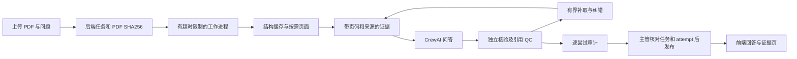

# 文献图表问答 P0–P2 工程验收

恢复断点见 [QA_AGENT_P0_P2_CHECKPOINT_2026-09-28.md](QA_AGENT_P0_P2_CHECKPOINT_2026-09-28.md)。本文说明工程行为及其边界，不是领域效果报告。

## 数据链路与发布条件



任务 `completed` 只表示执行结束；答案可以是 `answered`、`partial` 或 `refused`。答案、任务和审计使用同一个 PDF SHA256。工作进程只写本次 `result-{attempt}.json`，主管核对任务仍为 running、attempt 未变、答案 ID 和文档指纹匹配后才发布 `answer.json`。前端不得用草稿替代正式答案。

## P0：证据与纠错

- 主张自身必须提供证据 ID 和原文片段。每段引文需在所引证据中定位，每个引用来源也需有对应片段；checker 的引文不能救活回答的伪造引文。
- 复用既有语义事实核验与 QC，再执行问答来源闸门。自动引文检查不等于逻辑蕴含判断正确，更不等于专家金标准。
- 视觉主张需有真实视觉来源、匹配目标子图、实际输入页面及视觉观察引文。图注/正文不能替代读图；错页、缺子图、低置信度或视觉失败时仅可交付被正文/图注支持的部分内容，或拒答。
- 初轮最多增加 4 个正文块，每块最多 1500 字符；累计证据正文最多 18,000 字符。视觉限定一个目标图及解析器定位的关联页。核验使用带 ID 的同一有界证据视图。
- 后续最多两轮，可通过 evidence_gaps 定向补取方法、对照、统计或结果；没有新证据且没有纠错需求时停止，无新增信息且重复相同草稿时也停止。
- 后续生成/核验调用异常时保留此前已核验部分答案并明确新增证据未核验；如果后续核验发现冲突，则撤下相应主张，不能恢复已被否定的旧答案。
- 文献中的指令视为不可信数据。当前依赖受限工具、提示约束及独立核验，不声称已经通过真实提示注入攻防评估。

## P1：任务生命周期与证据查看

后台任务采用本地持久化队列，默认 2 个并发工作进程、每个任务执行最多 600 秒。任务排队时间不计入执行超时。同步接口也通过同一队列等待，超时返回 504；异步接口立即返回 202。

取消或超时终止工作进程组；Linux 父进程死亡保护避免主管异常退出后工作进程长期遗留。启动时把遗留 running 标记为 failed，将 queued 重新调度。失败、超时、取消支持显式 retry，attempt 递增，历史审计保留。不能通过重试覆盖旧轮次文件或将迟到结果发布为成功。

页面证据接口检查 UUID、PDF 指纹、页码范围和 evidence_id 与页面的关联。正文使用 parser 的原始 bbox 高亮；图注显示所属物理页，视觉另外提供实际输入页面列表。UI 从后端恢复任务，URL 只保存当前任务 ID，不保存持久业务结果。

当前限制：Linux、单 API 主管进程、本地可信环境；不支持多个 Uvicorn workers 或分布式队列，没有多用户鉴权与租户隔离。UI 显示阶段和已完成核验轮次，不伪造模型实时 token 进度。

## P1/P2：缓存与可追溯性

解析缓存按 PDF SHA256 与 parser 代码/PyMuPDF 版本隔离，并校验解析 JSON 的哈希。文件锁避免多个工作进程重复解析同一文档，原子替换避免读取半写产物。PDF 内容、解析版本或缓存完整性变化会重建结构。

问答使用 `PdfParser(render_assets=False)` 建立廉价结构索引；首次目标读图或用户查看页面时才渲染真实页面。全文报告仍使用原默认渲染模式。视觉语义缓存继续复用既有适配器的图片内容、模型、提示及图注指纹机制。

`audit-{attempt}.json` 保存：文档 SHA256、模型名/视觉配置、起始时间、解析版本、运行代码与 prompt 指纹、解析缓存命中、解析/总耗时，以及每轮实际证据、新增证据 ID、草稿、核验结果、QC、耗时和停止原因。模型名称可能是供应商别名，不冒称已固定供应商内部模型版本。每轮记录可计算逻辑生成/核验轮次，不等同于底层 HTTP 请求数或 token 账单；CrewAI/供应商重试及视觉缓存会影响真实请求数。

## P2：候选运行与验证分层

`scripts/run_qa_batch.py` 默认仅准备检查，校验本地 PDF 指纹；未绑定、文件缺失、指纹不符的候选不会调用模型。`--ids` 可筛选候选，未知或重复 ID 报错。真实运行需显式 `--real`，经同一受限工作进程执行。

每批保存独立 `manifest-{run_id}.json`，`manifest.json` 是最新清单；对应请求、答案和审计均留在该输出目录的 `questions/` 中。配置失败单独记录为 configuration_failed，运行失败记录为 execution_failed。真实运行记录只检查轮数、文档绑定、引用可定位、视觉失败诚实性和审计文件，不填写专家正确性分数。

```bash
# 不调用模型的准备检查
bash scripts/run.sh python scripts/run_qa_batch.py \
  --manifest evals/qa_smoke.jsonl --output evals/runs/qa-engineering-preflight

# 仅在数据发送获授权后执行真实冒烟
bash scripts/run.sh python scripts/run_qa_batch.py \
  --manifest evals/qa_smoke.jsonl --output evals/runs/qa-engineering-smoke --real
```

四个准备好的场景为正文问答、Figure 4a、缺失 Figure 99a 和无视觉降级。缺图可在任何模型调用前拒答，不能把这种记录计为真实模型成功调用。

## 当前验收状态

- 已完成工程实现、离线合成/故障回归及前端生产构建；最终测试数量以恢复断点文档与 PLANS.md 的最新记录为准。
- 四项冒烟的无模型准备检查通过，PDF 指纹正确。
- 真实冒烟命令被自动审批拦截，原因是需明确授权 MoDorado PDF 的选定内容发送至 `api.kimi.com` / `kimi-for-coding`。确认尚未收到，未执行外发；不能将准备检查写成真实调用成功。
- 无人工领域效果评分。自动检查通过不代表生物学结论、图形数值或因果解释正确。

尚需独立推进的后续工作是获授权后的真实冒烟及问题修复；领域正确率、证据召回率、拒答准确率等则在人工参考冻结后评估。
